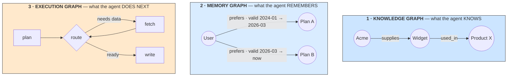

# **Module 9, Lesson 1: Graph Engineering — Making Structure Explicit**

### Building on What We've Learned

Everything so far has treated the agent's world as *flat*. Documents are chunks in a vector space with no relationships between them. Memory is a summary — prose that loses whatever the summarizer didn't value. Execution is a loop that goes round until something stops it.

Flat works, up to a point. Past that point you start hitting a specific class of failure: questions whose answer requires *connecting* things, memory that can't say a fact was true and then stopped being true, and control flow that can't branch, retry, or resume.

**Graph engineering** is the practice of making structure explicit — as typed nodes and edges a system can traverse, inspect, and modify. This lesson is the orientation; the next two go deep on the two kinds of graph that matter.

### Learning Objectives

By the end of this lesson, you will be able to:
*   **Distinguish** the three distinct things called "graph engineering" and know which one a given problem needs.
*   **Explain** why *typed* edges are the entire point, and what an untyped edge costs you.
*   **Apply** the five conditions under which a graph earns its cost.
*   **Compute** the compounding error that kills most graph projects, and set a per-hop accuracy floor.

---

### **1. Three Different Things Wear This Name**

The term entered common use around mid-2026, and it immediately started meaning three different things. Being precise about which one you mean saves a lot of confused architecture discussions.



| | Nodes are | Edges are | Answers | Covered in |
| :--- | :--- | :--- | :--- | :--- |
| **Knowledge graph** | Entities in your domain | Typed relationships | *"Which suppliers are affected by this incident?"* | Lesson 2 |
| **Memory graph** | Entities + episodes | Relationships **with validity intervals** | *"What did the customer prefer, and when did that change?"* | Lesson 2 |
| **Execution graph** | Units of work | Control flow and state | *"What runs next, and what does it receive?"* | Lesson 4 |

The first two are about **what is true**. The third is about **what happens**. They're different problems with different tooling, and the most common architecture mistake in this area is reaching for a graph *database* when what you needed was a graph-shaped *control flow*, or vice versa.

> **A quick diagnostic.** If your problem statement contains "how do these things relate," you want a knowledge or memory graph. If it contains "and then, unless, retry, in parallel, wait for approval" — you want an execution graph.

---

### **2. Typed Edges Are the Whole Point**

An untyped edge carries one bit: *these two things are related.*

A **typed** edge carries a claim you can reason with:

```
  Doc A  ── related ──▶  Doc B                    1 bit. Useless for reasoning.

  Policy_v2  ── supersedes ──▶      Policy_v1     Now you can answer "what is current?"
  Service_A  ── depends_on ──▶      Service_B     Now you can answer "what breaks if B fails?"
  Incident_7 ── caused_by  ──▶      Deploy_412    Now you can answer "what else did that deploy touch?"
  Decision_3 ── decided_by ──▶      Team_Platform Now you can answer "who do I ask?"
```

This is the difference between a graph that supports reasoning and one that is an expensive way to store similarity. **Vector search already tells you two things are related** — that's precisely what cosine similarity means. If your graph's edges are all "related to," you have rebuilt vector search with more infrastructure and worse recall.

**Keep the edge vocabulary small and controlled.** The 2026 practitioner consensus converged on this hard: a dozen well-defined edge types you can enumerate beats an open-ended vocabulary the extractor invents as it goes. An extractor free to coin `is_associated_with`, `relates_to`, and `has_connection_with` produces three edges that mean the same thing and none that you can query reliably.

---

### **3. When a Graph Earns Its Cost**

Graphs are genuinely expensive — see section 4 for why. Five conditions justify the cost, and you want at least two of them:

1. **Connected queries.** Answering requires traversing **two or more relationships**. *"Which supplier supports a component affected by an incident owned by a regulated team?"* A similarity search structurally cannot answer this — the answer exists in no single document.
2. **Relations that change over time.** Ownership, permissions, dependencies, org structure. You need to know not just what is true but *when it became true*.
3. **Provenance requirements.** A reviewer must be able to inspect where a claim came from and how it was extracted. Regulated domains make this non-negotiable.
4. **Shared world state across agents.** Several agents — research, support, compliance — reasoning over the same entities and needing to agree about them.
5. **Knowledge compounding across sessions.** Entity resolution done once pays off on every future query, rather than being redone per request.

**When to skip it.** One-off research questions · answers contained in a single document · independent parallelizable tasks · stable tabular data (that's a SQL join) · data too fresh to keep a graph in sync with.

> **The honest framing:** a graph is a **third retrieval primitive**, alongside vector and keyword search, with a real one-time construction cost and a real ongoing maintenance burden. It earns its place only when a **measurable fraction of your actual query traffic** asks questions similarity search structurally cannot answer. Measure that fraction before you build. As of 2025, fewer than 15% of enterprises had graph-based retrieval in production — the gap between how compelling graphs sound and how many ship is large, and it is mostly section 4.

---

### **4. The Arithmetic That Kills Graph Projects**

The failure point is almost never the query language or the database. It is **entity resolution**: deciding that "Dr. Smith," "J. Smith," "Jane Smith," and "smith_j@hospital.org" are one node, and that the *other* Dr. Smith is a different one.

Here is why it dominates everything else:

> **A per-hop accuracy of *p* gives you *p*ⁿ over *n* hops.**

| Per-hop accuracy | 2 hops | 3 hops | 5 hops |
| ---: | ---: | ---: | ---: |
| 95% | 90% | 86% | 77% |
| 90% | 81% | 73% | 59% |
| **85%** | 72% | 61% | **44%** |
| 80% | 64% | 51% | 33% |

At 85% entity resolution — which sounds respectable, and is roughly what a naive LLM extraction pipeline achieves on messy real data — **a five-hop traversal is 44% trustworthy.** You have built an expensive system that is wrong more often than not on exactly the queries you built it for.

> **What *p*ⁿ assumes, so you know when it bends.** It treats hop errors as independent and assumes one chain must be entirely correct. Reality deviates in both directions: errors are **correlated** — one mis-resolved hub node corrupts every path through it, so failures arrive in bursts rather than uniformly — and **redundant paths help** — a conclusion reachable two independent ways is more certain than either path alone claims. Treat *p*ⁿ as a planning heuristic for chain-shaped queries, not a law. It is accurate enough to kill a bad design at the whiteboard, which is its job.

**What this implies for design:**

*   **Set a per-hop accuracy floor before you build**, derived from your longest realistic traversal and your tolerable error rate. Below ~90% per hop, restrict yourself to short traversals.
*   **Prefer short, high-confidence traversals** to long, speculative ones. Two hops at 95% beats five hops at 85%, and answers most real questions.
*   **Track confidence along the path** and surface it. A traversal that crossed three uncertain resolutions should say so rather than presenting its conclusion flatly.
*   **Human-curated links are accurate by construction.** If your organization already maintains explicit links — wiki cross-references, ticket relations, a service catalogue, code imports — you have a high-accuracy graph for free, and you have skipped the step that kills most projects. This is why markdown vaults and codebases make surprisingly good graphs.

**The other recurring cost is semantic maintenance.** The database licence is rarely the whole bill. Budget for source connectors, schema design, extraction, entity resolution, human adjudication, permission mapping, temporal updates, retrieval, observability, and — the one everybody forgets — **rewriting the ontology when the business changes.** An ontology is a model of your domain, and domains move.

---

### **5. Where This Module Is Going**

The two halves of this module are more connected than they look.

Lessons 2 through 4 cover the graph kinds — including their fusion with vector memory in Lesson 3 — and Lesson 5 turns all of it into a practical setup guide. Lessons 6 and 7 cover **meta-harness systems** — agents that modify their own harness. The bridge between the halves is this:

> **A system can only safely rewrite what is explicit.**

An agent cannot meaningfully improve a control flow that exists as implicit branching buried in a `while` loop; it can propose an edit to a graph whose nodes and edges are declared data. It cannot audit what it learned when memory is prose; it can inspect a memory graph where every fact carries provenance and a validity interval.

**Making structure explicit is the precondition for making it modifiable.** That is the thread from here to the end of the course.

---

### **Key Takeaways**

*   Three distinct things are called graph engineering: **knowledge graphs** (what the agent knows), **memory graphs** (what it remembers, and when that was true), and **execution graphs** (what it does next). Name which one you mean.
*   **Typed edges are the point.** An untyped edge carries one bit and duplicates what vector search already does. Keep the vocabulary small and controlled.
*   A graph earns its cost on **connected queries, changing relations, provenance, shared world state, and compounding knowledge** — and only when a measurable share of real traffic needs them.
*   **Entity resolution dominates.** Per-hop accuracy *p* gives *p*ⁿ over *n* hops; at 85% a five-hop traversal is 44% trustworthy. Set a floor, prefer short traversals, track confidence.
*   **Human-curated links are accurate by construction** — the cheapest good graph is often one your organization already maintains.
*   Structure must be **explicit** before it can be safely **modified**. That is the bridge to the second half of this module.

### **Hands-On Task: Does the Graph Earn Its Cost?**

**Part A — Classify the graph.** For each, say which of the three graphs (knowledge / memory / execution) is needed, or none:

1.  A support agent that must remember a customer changed plans in March, without losing the fact that they were on the old plan before that.
2.  A compliance assistant answering *"which of our vendors process EU personal data through a sub-processor we haven't audited?"*
3.  A release pipeline: run tests, and if they fail, triage and retry up to twice, and if they still fail, page a human.
4.  A documentation search over 8,000 help-centre articles where users ask single-fact questions.
5.  An incident bot answering *"what else did the deploy that caused this incident touch?"*

**Part B — Run the arithmetic.** You're designing the compliance graph in scenario 2. It requires traversing: `Vendor → processes → DataCategory → via → SubProcessor → audited_by → Auditor`. That's three hops.

1.  Your extraction pipeline resolves entities correctly about 88% of the time. What fraction of answers are trustworthy?
2.  Compliance requires 95% trustworthiness. What per-hop accuracy do you need? *(Solve p³ ≥ 0.95.)*
3.  Is that achievable with LLM extraction from contracts? If not, name **two** design changes that get you there without improving the extractor.

**Part C — Design the edge vocabulary.** For scenario 5 (the incident bot), write the **complete** list of edge types you'd allow. Aim for eight or fewer. For each, give the type name and one sentence on what question it lets you answer. Then name one edge type you were tempted to include and rejected, and say why.
