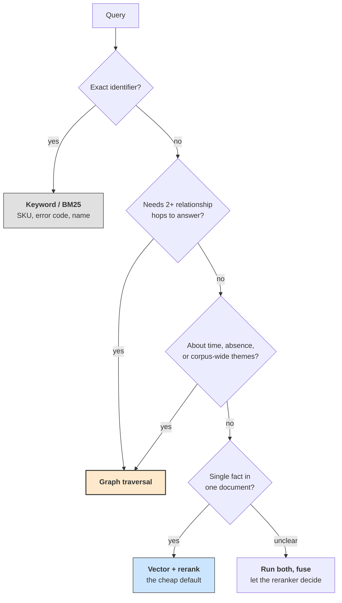

# **Module 9, Lesson 2: Knowledge and Memory Graphs**

### Building on What We've Learned

Module 3 taught retrieval as *finding the passage that contains the answer*. That framing has a hard limit: some answers are in no passage. *"Which supplier supports a component affected by an incident owned by a regulated team"* is assembled from four facts that live in four documents, and no amount of similarity search will surface it, because the question's semantics don't resemble any single source.

Module 4 taught memory as *summarize and carry forward*. That has its own limit: a summary flattens time. It can say the customer is on Plan B. It cannot say they were on Plan A until March, which is exactly what you need when they dispute a charge.

Graphs fix both, at a price.

### Learning Objectives

By the end of this lesson, you will be able to:
*   **Predict** where GraphRAG beats vector RAG, and by roughly how much.
*   **Execute** the nine-stage knowledge graph pipeline, and say why the order matters.
*   **Design** a bi-temporal memory graph and explain what its four timestamps buy you.
*   **Route** queries between vector, keyword, and graph retrieval by query shape.

---

### **1. GraphRAG vs. Vector RAG: What the Numbers Say**

Head-to-head comparisons through 2025–2026 are consistent, and the shape of the result is more useful than any single figure:

> **Neither wins outright. Vector RAG takes single-hop and detail-oriented questions. GraphRAG takes multi-hop and global sensemaking.**

The gaps on multi-hop are large. Reported figures cluster around: **86% vs. 32%** on one multi-hop benchmark; **53.4% vs. 42.9%** on another; consistent significant improvements across HotpotQA, MuSiQue, Natural Questions, and 2Wiki — with **the largest gain on MuSiQue, the four-hop set.** A production medical-reasoning system reported **94.2% vs. 49.9%** on multi-hop clinical questions.

Treat the exact numbers as directional — they depend heavily on corpus, extraction quality, and who is publishing. **The robust finding is the pattern:** the advantage scales with hop count, and it is roughly zero at one hop.

**Two question types where graphs win that people underrate:**

*   **Global sensemaking.** *"What are the main themes across these 4,000 incident reports?"* No chunk contains the answer; it's a property of the whole corpus. Graph community detection can summarize clusters; top-k retrieval structurally cannot.
*   **Negative and completeness queries.** *"Which of our services have **no** documented owner?"* Similarity search finds things that exist. Only a structured store answers questions about absence.

---

### **2. The Nine-Stage Pipeline**

The order is the lesson. Most failed graph projects extracted first and modelled afterwards.

```
1. SCOPE           What questions must this answer? Which entities are in and out?
2. REPRESENTATION  Property graph? RDF? What is a node vs. a property?
3. ONTOLOGY        The typed schema. Entity types, edge types, cardinality, constraints.
   ───────────────── everything above happens BEFORE you touch the corpus ─────────────────
4. ENTITIES        Extract entity mentions and resolve them to canonical nodes.
5. RELATIONS       Extract typed edges, constrained by the ontology.
6. EVENTS          Attach temporal and contextual facts.
7. QUALITY GATE    Verify against the ontology. Reject what violates it.
8. FUSION          Deduplicate, merge, adjudicate conflicts.
9. SERVE           Expose traversals as tools an agent can call.
```

> **Model the domain before extracting. Fuse before storing. Verify at every stage.**

**Why the order matters.** Extraction without an ontology is the single most common way to spend three months building an unusable graph. An unconstrained extractor invents edge types, so you get `works_at`, `employed_by`, and `is_staff_of` describing one relationship, and no query returns complete results. The ontology is what makes stage 7 possible — you cannot have a quality gate without a specification to check against.

**Stage 1 deserves more time than it gets.** "What questions must this answer?" is not a formality; it determines the ontology, and an ontology built for the wrong questions is worse than no graph, because it looks like it should work.

**Stage 8 (fusion) is where entity resolution actually lives**, and per Lesson 1 it dominates your accuracy. Budget accordingly: this is typically the largest single engineering cost in the pipeline.

**The 2026 shift: lazy and agentic construction.** Full up-front extraction over a large corpus is expensive and much of it is never queried. Newer systems infer the schema from a sample, build the graph incrementally around actual query traffic, and let the agent decide which hops to take at query time rather than precomputing every path. The trade is latency for construction cost — worth it when the corpus is large and query patterns are narrow.

---

### **3. Bi-Temporal Memory: Four Timestamps**

This is the idea that makes graphs genuinely better than summaries for agent memory, and it's simpler than it sounds.

A memory system needs to distinguish two different clocks:

| Timestamp | Means | Answers |
| :--- | :--- | :--- |
| `t_valid` | When the fact **became true in the world** | "Since when have they been on Plan B?" |
| `t_invalid` | When it **stopped being true** | "When did they leave Plan A?" |
| `t_created` | When the system **learned it** | "When did we find out?" |
| `t_expired` | When the system **stopped believing it** | "When did we correct our records?" |

Keeping both clocks lets a system answer three questions a summary cannot:

*   **"What is true now?"** → edges where `t_valid ≤ now < t_invalid`
*   **"What was true in March?"** → edges where `t_valid ≤ March < t_invalid`
*   **"What did we *believe* in March?"** → edges where `t_created ≤ March < t_expired`

That third one is what auditability means. When a decision was made on wrong information, you need to reconstruct **what the system knew at the time**, not what it knows now. A summary that was overwritten cannot do this. Neither can a graph that deletes superseded edges.

**The critical design rule:**

> **Invalidate; never delete.** When new information conflicts with old, set `t_invalid` on the old edge and add a new one. History is preserved, current state is a filter, and "the customer changed plans in March" becomes a queryable fact rather than a lost one.

**A layered memory architecture** that has become the common shape:

```
  episodes         raw messages / events, immutable, append-only
      ↓ extract
  entities+facts   typed nodes and edges with bi-temporal validity
      ↓ cluster
  communities      summaries over clusters, for global sensemaking
```

Each layer answers different questions: episodes for "what exactly was said," facts for "what is true," communities for "what are the themes."

> **A finding worth knowing.** A 2026 architectural study compared thirteen agent-memory configurations across 385 adversarial cases and found that **where the control plane sits** — the component that supersedes, releases, and purges facts — determines which forgetting failures the system can recover from. Deterministic rules handled lexical and temporal cases but failed at canonicalization (5% on identifier obfuscation, 0% cross-lingual). Extraction-time model calls fixed canonicalization (100%) but could not handle intent-aware deletion (0%). A **mutation-time hook** — a model call at the moment a fact is superseded or deleted — recovered intent-aware deletion (78–85%) and lifted nearly every category at once (91.7–93.2% overall), at roughly $0.17 per 385-case run.
>
> The transferable lesson: **the hard part of memory is not writing facts, it is correctly invalidating them.** Put your intelligence at the mutation point, not only at the ingestion point.

---

### **4. Routing: Which Retrieval for Which Query**

Nobody should run one retrieval primitive. Route by query shape — and note that this extends the decision guide from Module 3, Lesson 5 with a third primitive.



Note where the time/absence/themes check sits: on the **single-hop side**. That is deliberate — *"which services have no owner?"* is not multi-hop, and *"who owned this in January?"* is one hop, yet both need the graph. Temporal, absence, and corpus-wide questions route to the graph regardless of hop count.

**Practical notes:**

*   **Vector is the cheap default.** Route to the graph only when the query needs it. Most production traffic doesn't.
*   **Fuse rather than choose** when routing is uncertain. Run both, merge with RRF (Module 3, Lesson 3), let the reranker sort it out. Reported gains from combining at the response stage are modest but real.
*   **Route on structure, not on a model's opinion.** "Does this query name two entity types?" is a cheap deterministic check. Asking a model "is this multi-hop?" adds latency and a failure mode.
*   **Return provenance from graph traversals.** The path *is* the explanation: `Incident_7 --caused_by--> Deploy_412 --touched--> Service_B`. Surface it. It is the strongest form of citation available anywhere in this course, because it shows the reasoning rather than just the source.

---

### **Key Takeaways**

*   **Neither retrieval mode wins outright.** Vector takes single-hop and detail; graphs take multi-hop and global sensemaking. The advantage **scales with hop count** and is near zero at one hop.
*   Graphs also uniquely answer **completeness and absence** questions — similarity search can only find things that exist.
*   Run the **nine stages in order**. Model the domain before extracting; the ontology is what makes a quality gate possible.
*   **Bi-temporal memory keeps two clocks** — when a fact was true, and when you believed it. **Invalidate, never delete.**
*   The hard part of memory is **correct invalidation**, not writing. Put intelligence at the mutation point.
*   **Route by query shape**, fuse when uncertain, and **return the traversal path as provenance**.

### **Hands-On Task: Build the Model Before the Graph**

**Scenario.** You're building a knowledge and memory graph for an internal engineering assistant. It must answer:

*   *"Who owns the service that caused last Tuesday's incident?"*
*   *"Which services depend on `auth-lib`, transitively?"*
*   *"Which of our services have no on-call rotation defined?"*
*   *"Who owned `payments-api` in January, when that decision was made?"*
*   *"What are the recurring themes in our last 200 postmortems?"*

**Part A — Stages 1 to 3.** Do the modelling before any extraction.

1.  **Scope.** Which entity types are in? Which are deliberately out?
2.  **Ontology.** Write the complete schema: entity types, edge types (eight or fewer), and for each edge its direction, cardinality, and whether it is time-varying.
3.  For each of the five questions, write the traversal that answers it. **If a question cannot be answered by your schema, fix the schema** — that is what stage 1 is for.

**Part B — Temporality.** Question four asks who owned a service *in January*.

1.  Which edges in your schema need bi-temporal validity, and which don't? Justify the ones you left out.
2.  A service is transferred from Team A to Team B on 3 March. Write the exact before-and-after state of the relevant edges, with all four timestamps.
3.  On 10 March you discover the transfer actually happened on 20 February and your records were wrong. Show the resulting edge state. Which timestamps change, and which must not?

**Part C — Routing and cost.**

1.  For each of the five questions, name the retrieval primitive you'd route to and why.
2.  Question three asks about **absence**. Explain in one sentence why no amount of vector-search tuning can answer it.
3.  Your entity resolution runs at 91%. Question two is transitive — realistically four hops deep. What fraction of those answers are trustworthy, and what would you change: the extractor, the schema, or the question you let users ask?
