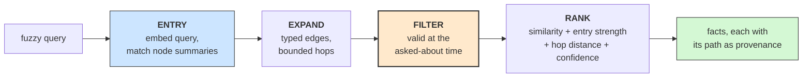

# **Module 9, Lesson 3: Continuous Vector Memory Graphs**

### Building on What We've Learned

Lesson 2 gave memory structure and time: typed facts, bi-temporal validity, invalidate-never-delete. It left a practical hole that anyone who builds one hits in the first week:

**How do you get *into* the graph?**

A traversal starts from a node. Users don't give you nodes — they give you fuzz: *"that thing the customer said about billing,"* *"the supplier issue from a while back."* Module 3 solved fuzzy lookup with vector search, but a vector store has no structure and no time. So teams run both — a vector store *and* a memory graph — and discover they've built a synchronization problem.

The **continuous vector memory graph** is the 2026 consensus answer: one store where nodes and facts carry embeddings that are maintained continuously, giving fuzzy entry, structural expansion, and temporal filtering in a single system.

### Learning Objectives

By the end of this lesson, you will be able to:
*   **Explain** the entry problem and why two separate stores create a drift problem.
*   **Trace** a query through the entry → expand → filter → rank pipeline.
*   **Apply** the two subtleties that separate working systems from naive ones: invalidation-aware vectors and mutation-time node refresh.
*   **Compute** the cost difference between embed-on-write and batch rebuilds — the operational meaning of "continuous."

---

### **1. The Problem: Two Stores, One Truth, Guaranteed Drift**

The obvious architecture is a vector store for fuzzy lookup next to a memory graph for structure, joined by shared ids. It works — and it fails in a specific, predictable way.

Lesson 2's rule was **invalidate, never delete**. Now apply it across two stores. Kim moves from the Starter plan to Growth in March:

*   The **graph** does the right thing: closes the old edge's validity window, opens a new one.
*   The **vector store** has an embedded copy of *"Kim is on the Starter plan."* What happens to it?
    *   **Delete it** → your "as of February" queries silently break. The vector side no longer knows Starter ever existed.
    *   **Leave it** → every "what plan is Kim on?" query surfaces the superseded fact forever, because *an embedding doesn't know its fact stopped being true.*

Every update now requires a coordinated mutation across two systems with different consistency models — and the failure mode of getting it wrong is *silent*: nothing errors, retrieval just quietly serves stale or amputated memory.

> **The design insight:** the vector index and the graph aren't two systems that need synchronizing. They are **two indexes over one set of facts** — and they belong in one store where a single mutation updates both.

---

### **2. What It Is — and What the Name Means**

> A **continuous vector memory graph** is a memory graph (typed edges, bi-temporal validity) whose **nodes and facts each carry an embedding**, maintained **continuously** — embedded at write time, refreshed at mutation time, never batch-rebuilt.

**A note on the name.** As with "graph engineering" itself (Lesson 1), the label is newer than its parts. What's established is the pattern, which the 2026 agent-memory literature converged on hard:

*   **Hybrid is the consensus.** Production agent memory settled on vector + graph + an episodic buffer — surveys of serious deployments describe this combination as the default, not a debate. Temporal-knowledge-graph memory with hybrid (semantic + keyword + graph) search is the reference architecture, and it measurably outperforms flat vector memory on long-conversation benchmarks — roughly 64% vs. 49% on LongMemEval in one widely-cited comparison. Directional, as always; the pattern is the finding.
*   **Vector-entry-then-traverse is the standard retrieval shape.** Embed the query, find entry nodes by similarity, then expand through the graph — whether the expansion is BFS over typed edges or Personalized PageRank seeded from the matched nodes (the HippoRAG family).
*   **Incremental construction won.** The same shift as Lesson 2's "lazy and agentic construction": embed and index at write time, not in nightly batches.

"Continuous" carries two readings, and it's worth separating them. The *mathematical* one — facts live in a continuous vector space rather than only a discrete symbol space — is true but not the point. The *operational* one is the point: **the index is never stale and never rebuilt.** Every write updates exactly what it touches.

---

### **3. The Retrieval Pipeline: Entry → Expand → Filter → Rank**



**Entry.** Embed the query; score it against **node summaries** (name, type, properties, and the text of the node's *currently valid* facts). Top-k matches are your entry points. This is what replaces "the user must know an entity id."

**Expand.** From each entry node, walk typed edges — both directions — for a bounded number of hops. This is what pure vector search cannot do: reach a fact that shares *no vocabulary* with the query but is two edges from something that does. *"Which tier is invoice 7712 under?"* enters through the invoice node and reaches the subscription fact through the customer — a fact the query's words would never find.

**Filter.** Keep only edges valid at the asked-about time. `at=None` means now; `at=February` answers the historical question. Same pipeline, one parameter.

**Rank.** Fuse the signals: semantic similarity of the fact itself, the entry node's match strength, hop distance (closer to the entry is more likely relevant), and the edge's own confidence (Lesson 1's *p* per hop, surfacing in the score instead of being hidden). Return the path with each result — **the traversal is the citation.**

The runnable version of this whole pipeline is [`ce/vectorgraph.py`](../../code/ce/vectorgraph.py), demonstrated in [`examples/10_vector_memory_graph.py`](../../code/examples/10_vector_memory_graph.py).

---

### **4. The Two Subtleties That Separate Working Systems**

**A. An embedding outlives the truth of its fact.**

A superseded fact still *matches* forever — semantic similarity has no clock. The naive designs both fail:

| Naive design | What breaks |
| :--- | :--- |
| Delete the vector when the fact is superseded | "As of February" queries — history amputated from the vector side |
| Keep it, unfiltered | "Now" queries surface the superseded fact indefinitely |

**The rule: keep the vector, filter by validity at query time.** This is Lesson 2's invalidate-never-delete extended to the index. Practical note: most ANN indexes can't pre-filter on a validity interval, so at scale this is metadata filtering where your store supports it and post-filtering where it doesn't — either way the vector is never the authority on whether a fact is *current*; the graph is.

**B. Node embeddings rot when their neighbourhood changes.**

A node's searchable identity is built partly from its facts. When Kim's subscription changes, the summary embedded in January — *"Kim Nakamura … Starter"* — is now wrong in exactly the way that matters for entry: a Growth-related query won't route through Kim, and a Starter-related one still will.

**The fix: re-embed the touched nodes at the mutation point** — the same place Lesson 2's control-plane research put the invalidation intelligence. Every write refreshes the fact it creates plus the nodes it touches, including the endpoint a fact *leaves* (Kim's summary must stop claiming Starter, not just start claiming Growth). Miss that last one and your entry points stay half-stale — the bug is asymmetric and easy to ship.

---

### **5. "Continuous" Is a Cost Claim**

The alternative to embed-on-write is the batch rebuild: re-extract and re-embed on a schedule. The comparison is not close.

| | Embed-on-write | Nightly batch rebuild |
| :--- | :--- | :--- |
| Cost per day (50k facts, 400 writes) | ~1,600 embed calls (fact + touched nodes) | 50,000+ embed calls, *whether anything changed or not* |
| Staleness window | ~zero | Up to a day |
| Write cost scales with | The neighbourhood touched | The whole corpus |

Two caveats to keep it honest:

*   **Latency.** The graph hop is not free — reported figures for graph-memory lookups run a few hundred milliseconds over plain vector search. For most agent turns that's noise; for a hot interactive path it's a routing decision (Lesson 2 §4: vector remains the cheap default, the graph is for the queries that need it).
*   **The embedder is part of the schema.** Change embedding models and *every stored vector is invalidated at once* — the one event that genuinely forces a full rebuild. Version-pin the embedder and plan that migration deliberately (Lesson 5 §3).

**When not to bother:** short-lived sessions with no cross-session reuse (Module 4's techniques suffice), corpora with no meaningful relationships (plain vector RAG), and anywhere you weren't already justified in building the memory graph (Lesson 1's five conditions still gate everything — CVMG makes a justified graph *reachable*, it does not justify the graph).

---

### **Key Takeaways**

*   Separate vector and graph stores over one set of memories create a **synchronization problem whose failure mode is silent**. A CVMG is one store with two indexes, mutated together.
*   Retrieval is **entry → expand → filter → rank**: fuzzy similarity finds where to start, typed edges reach what similarity can't, validity filters *when*, fused scoring ranks — and **the path is the citation**.
*   **An embedding outlives its fact's truth.** Keep the vector, filter by validity at query time — deleting breaks as-of, not filtering pollutes now.
*   **Refresh node embeddings at the mutation point**, including the endpoint a fact leaves. Stale summaries mis-route entry.
*   "Continuous" means **embed-on-write, O(neighbourhood) per write** — versus O(corpus) batch rebuilds with a staleness window. The one forced rebuild is changing your embedder: version-pin it.
*   CVMG makes a justified memory graph **reachable by fuzzy queries**. It does not justify the graph — Lesson 1's conditions still decide that.

### **Hands-On Task: Design the Recall**

**Scenario.** A support agent's memory holds these facts (validity in brackets):

```
F1  "Kim Nakamura signed up for the Starter plan"        [Jan → Mar]
F2  "Kim Nakamura upgraded to the Growth plan"           [Mar → now]
F3  "Invoice 7712 was billed to Kim Nakamura"            [Jan → now]
F4  "Ticket 88 from Kim: dispute about an invoice"       [Feb → now]
F5  "Growth plan includes priority support"              [always]
F6  "Refund of invoice 7712 approved by finance"         [Apr → now]
```

**Part A — Trace the pipeline.** For each query, name the likely entry node(s), the facts reached at each hop, what the validity filter removes, and the top-2 ranked results:

1.  *"what is Kim paying for these days"* (asked now)
2.  *"what plan was Kim on when she opened the dispute"* (asked now, about February)
3.  *"is the customer on ticket 88 entitled to priority support"* — say explicitly why pure vector search fails on this one.

**Part B — Critique a naive design.** A teammate proposes: a vector store of fact texts plus a separate graph, joined by ids; on supersede, delete the fact's vector; re-embed all node summaries in a nightly batch. Name **three** distinct failures, and for each say what query exposes it and what the user sees.

**Part C — Run the cost arithmetic.** 50,000 facts, 400 new facts/day, average node degree such that each write touches 2 nodes.

1.  Embed calls per month: embed-on-write vs. a nightly full rebuild.
2.  Your team switches embedding models. What does it cost, and why is this the one case where the batch machinery earns its keep?
3.  A hot query path needs <100 ms and the graph hop costs ~300 ms. What do you do — and which lesson already answered this?
