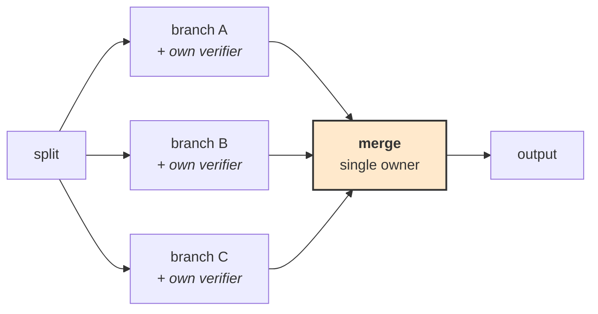

# **Module 9, Lesson 4: Execution Graphs — Orchestration as Structure**

### Building on What We've Learned

Module 8 gave you a loop: assemble context, call the model, dispatch tools, verify, repeat. It has one control-flow shape — round and round until a verifier says stop — and for a great many agents that is exactly right.

It runs out at a specific point. A loop cannot easily express: *run these three things in parallel, wait for all of them, and if the second one fails retry it twice before escalating, but pause for human approval before the final step, and if the process dies at hour two resume from where it stopped.*

That's not a loop. That's a **graph**, and writing it as a loop means encoding the graph implicitly in flags and nested conditionals that nobody — including a meta-agent, as Lessons 6 and 7 will need — can inspect or modify.

### Learning Objectives

By the end of this lesson, you will be able to:
*   **Model** an agent workflow as nodes, edges, and shared state.
*   **Explain** what checkpointing buys, and why durable execution is the main reason to adopt a graph runtime.
*   **Apply** the four task-graph patterns, including the topology finding that predicts which multi-agent designs fail.
*   **Decide** when a graph runtime is over-engineering.

---

### **1. Nodes, Edges, State**

An execution graph has three parts and one rule.

*   **Nodes** are units of work: a model call, a tool call, a deterministic function, a human checkpoint, a sub-graph.
*   **Edges** are control flow. **Conditional edges** route on the current state — this is where branching lives.
*   **State** is an explicit, typed object that flows along the edges and is updated by nodes.

**The rule: state is explicit.** In a loop, state is whatever accumulated in the message list plus some local variables. In a graph, it's a declared schema every node reads from and writes to. That single change is what makes the rest possible.

```python
class ReviewState(TypedDict):
    diff: str
    findings: list[Finding]
    tests_passed: bool | None
    attempts: int
    approved: bool | None       # set by the human gate

graph = StateGraph(ReviewState)
graph.add_node("analyze", analyze_diff)
graph.add_node("run_tests", run_tests)
graph.add_node("fix", propose_fix)
graph.add_node("await_approval", human_gate)   # a first-class node — the run
                                               # suspends here, for days if needed
graph.add_node("merge", merge_pr)              # irreversible — so it sits BEHIND
                                               # the gate, never in front of it
graph.add_node("escalate", hand_to_human)      # a real terminal state, defined
                                               # like any other node

graph.add_edge("analyze", "run_tests")
graph.add_conditional_edges(
    "run_tests",
    lambda s: (
        "await_approval" if s["tests_passed"]
        else "fix"       if s["attempts"] < 3
        else "escalate"
    ),
)
graph.add_edge("fix", "run_tests")             # the cycle
graph.add_conditional_edges(
    "await_approval",
    lambda s: "merge" if s["approved"] else "escalate",
)
```

Note the ordering: **the approval gate precedes the merge.** Approving an action that has already happened is not a gate, it's a notification (Module 8, Lesson 2). And `escalate` is defined like any other node — a routing function that names an undefined target is exactly the kind of bug the graph's static validation exists to catch.

Read that routing function again. In a loop it would be branching buried inside the iteration body, mixed with context assembly and tool dispatch. Here it is **a pure function from state to next node** — testable in isolation, visualizable, and, importantly for Lesson 4, *editable by something other than a human*.

---

### **2. What You Actually Buy: Durable Execution**

Branching is the visible benefit. **Checkpointing is the one that justifies the adoption.**

A checkpointer persists the state object after every node. That gives you:

| Capability | Why it matters |
| :--- | :--- |
| **Crash recovery** | An agent four hours into a task resumes from its last node instead of starting over |
| **Human-in-the-loop that actually waits** | A workflow can pause at an approval node for three days. The process exits; state persists; approval resumes it |
| **Time-travel debugging** | Rewind to any checkpoint, change the state, and replay. This is a genuinely different debugging experience |
| **Deploy without losing work** | Redeploy mid-run; in-flight workflows resume |

The human-in-the-loop row is the one teams underestimate. Module 8 said irreversible actions need a human gate. In a loop, "wait for approval" means either blocking a process for hours or building your own state persistence and resumption — which is most of a graph runtime, written worse. In a graph, it's a node.

> **Two cautions on resumption.** First, **non-idempotent nodes are dangerous on replay** — a node that charges a card must not run twice because a downstream node failed. Mark side-effecting nodes and make them idempotent with a key, or fence them behind a check. Second, **a checkpoint is a serialized snapshot**, so state must stay serializable and reasonably small. An agent stuffing 200k tokens of documents into the state object turns every node transition into a large write.

---

### **3. Four Task-Graph Patterns**

**A. Delete fake edges.**
Draw your graph, then remove every arrow where work does not actually flow. Teams routinely draw sequential dependencies that exist only because that's the order someone thought of the steps. Every false edge is serialization you're paying for and parallelism you're not getting.

Test each edge: *"does B genuinely need something A produced?"* If not, the edge is decoration.

**B. The diamond.**
Split work into parallel branches, give each branch **its own verifier context**, then merge under a single owner.



Two details make it work. **Separate verifier contexts** mean each branch is checked without seeing the others — an aggregate check run over everything at the end tends to accept work that is individually wrong but collectively plausible. **A single merge owner** means one agent is accountable for reconciling conflicts, rather than three agents each assuming someone else handled the overlap.

**C. The stop rule.**
The most useful empirical finding in multi-agent orchestration, and it is about **topology**, not agent quality:

> Agent teams succeed at a high rate — around 80% in the reported work — on **parallelizable** work, and fail on **long sequential chains**.

The mechanism is the arithmetic from Lesson 1 in a different costume. If each step in a chain succeeds with probability *p*, an *n*-step chain succeeds at *p*ⁿ. At 90% per step, a six-step chain is 53%. **Adding more capable agents does not fix this; shortening the chain does.**

So the stop rule: **when you find yourself designing a long sequential chain of agents, stop and restructure.** Parallelize what you can, insert deterministic verification between steps so errors don't propagate, or collapse several agent steps into one. A four-node graph with three parallel branches will outperform a nine-node chain, reliably.

**D. The human gate.**
Place approval **exactly where reversal is expensive**, not uniformly. Module 7, Lesson 3 established that a gate approved 99.8% of the time isn't a control; the graph is where you implement the alternative — few gates, on high-consequence edges, each showing evidence.

---

### **4. Relationship to Module 8's Orchestration Patterns**

The five patterns from Module 8, Lesson 3 are **graph topologies**. Seeing them that way makes their trade-offs concrete:

| Pattern | As a graph | Why it fails the way it does |
| :--- | :--- | :--- |
| Fan-out | One node → N parallel → join | The join node needs an explicit aggregation policy, or partial failure is ambiguous |
| Pipeline | Linear chain | *p*ⁿ. This is the stop rule's target |
| Debate | N parallel → judge node | The judge node is a single point of bias |
| Supervisor | Central node with conditional edges out and back | Routing quality *is* the conditional-edge function |
| Swarm | Dense graph, no central node | No single owner means no clear place to put verification |

**The useful consequence:** once orchestration is a graph, choosing a pattern is choosing a shape, and you can reason about the shape directly. "Our supervisor over-delegates" becomes "our conditional-edge routing function is wrong" — which is a testable pure function rather than a vague complaint about a prompt.

---

### **5. When a Graph Runtime Is Over-Engineering**

Graph frameworks are not free. They cost you a dependency, a learning curve, hidden prompt injections you didn't write, and debuggability inside someone else's execution engine (Module 5, Lesson 3).

**Stay with the loop when:**
*   Control flow is genuinely "keep going until verified." Most single agents.
*   Runs complete in minutes, so crash recovery is a retry.
*   There is no human-in-the-loop pause.
*   You have one branch point, expressible as an `if`.

**Move to a graph when:**
*   Runs are **long enough that crashing is expensive** — this is the strongest single reason.
*   You need to **pause for human approval** and resume later.
*   There is **real parallelism** with a join.
*   Control flow has **several branch points** you're currently encoding in flags.
*   You need to **inspect or modify the topology** — including programmatically, which is where Lesson 6 goes.

> **The honest middle path:** write the state object and the routing functions as **your own plain code** first (Module 5, Lesson 3 — confine the framework to one file). You get explicit state and testable routing immediately. Adopt a graph runtime when you need durable execution, which is the part that is genuinely hard to build well.

---

### **Key Takeaways**

*   An execution graph is **nodes (work), edges (control flow), and explicit typed state**. Making state explicit is what enables everything else.
*   Routing becomes a **pure function from state to next node** — testable, visualizable, and modifiable.
*   **Durable execution is the real payoff**: crash recovery, human pauses that actually wait, time-travel debugging. Watch out for non-idempotent nodes on replay and oversized state.
*   Four patterns: **delete fake edges · the diamond (separate verifiers, single merge owner) · the stop rule · the human gate**.
*   **The stop rule is arithmetic:** long sequential chains fail at *p*ⁿ. Shorten the chain; don't buy better agents.
*   Module 8's orchestration patterns **are graph topologies**, and seeing them that way turns vague complaints into testable routing functions.
*   Stay with a loop for short, single-branch, unattended-free work. Move to a graph for **long runs, human pauses, real parallelism, or modifiable topology**.

### **Hands-On Task: Model the Graph**

**Scenario.** A quarterly compliance review agent:

1.  Pull all vendor contracts changed this quarter (~200).
2.  For each: extract obligations, check them against current policy, flag discrepancies.
3.  Any contract flagged **high-risk** must be reviewed by a compliance officer before the report includes it. Review can take days.
4.  Produce a single report.
5.  The whole run takes 6–8 hours. It has crashed twice this year.

**Part A — Draw the graph.** Define the state schema, the nodes, and the edges (marking which are conditional). Then:

1.  Identify every edge that is **fake** — drawn out of habit rather than genuine dependency.
2.  Where is the diamond? What is each branch's verifier, and who owns the merge?
3.  Where exactly does the human gate go, and what does the officer see?

**Part B — Durability.** The run crashes at contract 140 of 200, three hours in.

1.  What must be in the checkpointed state for a resume to be correct rather than merely possible?
2.  One node posts a comment to the vendor-management system. Why is this dangerous on replay, and what makes it safe?
3.  A compliance officer takes four days to approve. Describe what the system is doing during those four days under a graph runtime, versus under the Module 8 loop.

**Part C — The stop rule.** A colleague proposes: `fetch → extract → normalize → check_policy → assess_risk → draft_finding → review_finding → format → report` — nine sequential agent steps per contract.

1.  At 92% per-step reliability, what is the end-to-end success rate per contract? Across 200 contracts, roughly how many complete cleanly?
2.  Restructure it. Show the new topology and the new success arithmetic.
3.  One of your changes helps for a reason other than parallelism. Name it and explain the mechanism.
