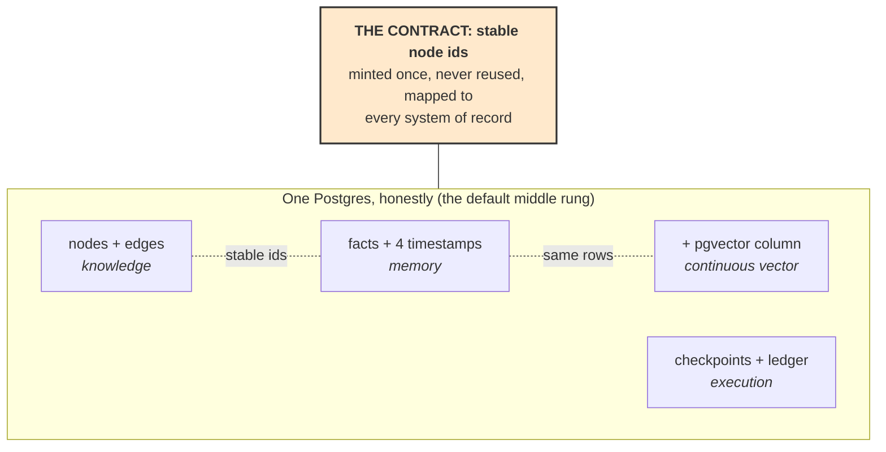

# **Module 9, Lesson 5: Standing Up the Four Graphs — A Practical Setup Guide**

### Building on What We've Learned

Lessons 1–4 taught four graph types as concepts. This lesson is the builder's guide: for each one, the minimum viable setup, the storage ladder from teaching code to production infrastructure, the write path, the read path, and the first things to measure.

One recipe repeats throughout, so here it is once:

> **1. Justify → 2. Schema first → 3. Smallest storage that works → 4. Gated write path → 5. Read path as tools → 6. Measure before scaling → 7. Know the classic mistake.**

And one contract underlies everything in section 5: **stable node ids.** Every integration problem between graphs, vector stores, and databases is an id-discipline problem wearing a costume.

### Learning Objectives

By the end of this lesson, you will be able to:
*   **Stand up** each of the four graph types at the smallest scale that teaches you something real.
*   **Choose** a storage rung deliberately, and know what forces a promotion to the next.
*   **Expose** each graph to an agent as tools with proper descriptions and scopes.
*   **Run** the acceptance drills that prove a setup works before it matters.

---

### **1. Knowledge Graph**

**Justify first** (Lesson 1 §3): two or more of — connected queries, changing relations, provenance, shared world state, compounding knowledge. Measured against *real* query traffic.

**Schema first.** The ontology is a versioned artifact in your repo, written *before* extraction — entity types, ≤8 edge types with direction, cardinality, and time-variance. This file is what makes the quality gate possible; without it you're building Lesson 1's expensive vector index.

**The storage ladder:**

| Rung | Use | Promotes when |
| :--- | :--- | :--- |
| `ce.Graph` / NetworkX, in-memory | Learning, prototypes, <~10k edges | You need persistence or concurrent writers |
| **Postgres: `nodes` + `edges` tables** | Most production systems, honestly | Recursive traversals dominate your query time |
| Dedicated graph DB (Neo4j, Kuzu, Memgraph) | Deep traversals, graph algorithms at scale | — |

The middle rung is underrated and where most teams should stop: two tables, foreign keys, a recursive CTE for traversal, and every operational tool you already run. A dedicated graph database is a new service to secure, back up, and keep in sync — buy that cost when traversal depth demands it, not because the query language is pleasant.

**Write path, in order:** derive-don't-extract where a system of record exists (dependencies from lockfiles, ownership from the service catalogue — ~100% accuracy for free) → LLM extraction constrained by the ontology → **quality gate rejects** undeclared types and wrong endpoints → entity resolution with a human adjudication queue for low-confidence merges → fuse → serve.

**Read path — the graph is tools, not a query console:**

```python
reg.register("graph_neighbors",
    "Facts directly connected to an entity, optionally filtered by edge type.",
    {"entity_id": {"type": "string"}, "edge_type": {"type": "string"}},
    required=("entity_id",),
    when_to_use="Use for one-hop questions; use graph_path for how two entities connect.")

reg.register("graph_path",
    "Typed paths between two entities, with per-path confidence. Withholds paths below the confidence floor.",
    {"from_id": {"type": "string"}, "to_id": {"type": "string"}, "max_hops": {"type": "integer"}},
    required=("from_id", "to_id"))

reg.register("graph_missing",
    "Entities of a type lacking a given relationship — the absence query.",
    {"node_type": {"type": "string"}, "edge_type": {"type": "string"}},
    required=("node_type", "edge_type"))
```

Everything from Module 5 applies: results are token-budgeted, errors are actionable, and the confidence floor from Lesson 1 lives *in the tool*, so no agent ever receives a 44%-trustworthy path presented flatly.

**Measure first:** per-hop entity-resolution accuracy on a gold set (this number times itself is your ceiling — Lesson 1 §4) · relation precision/recall · stale-edge rate.
**Classic mistake:** extracting before modelling.

---

### **2. Memory Graph**

**Schema first.** Three layers (Lesson 2 §3): `episodes` (raw events, append-only, immutable) → `facts` (typed edges with **all four timestamps**) → optional `communities`. Episodes are your re-derivation insurance: facts can be rebuilt from episodes; the reverse is impossible.

**Storage ladder:** `ce.Graph` + `Workspace` → **SQLite/Postgres** (a `facts` table with four timestamp columns — bi-temporality is columns and `WHERE` clauses, not exotic infrastructure) → a purpose-built temporal-graph memory platform (the Graphiti/Zep shape) when you want extraction, resolution, and hybrid search off the shelf.

**Write path:** the intelligence goes at the **mutation point** (Lesson 2's control-plane finding): ingest episode → extract candidate facts → resolve entities → *check for conflicts with existing facts* → *invalidate, never delete* → write. The conflict-check-then-invalidate step is the memory graph; everything else is plumbing.

**Read path:** `remember(query, at=None)` and `history(entity_id)` — the `at` parameter is the whole reason you built this.

**One legal caveat, stated plainly:** *invalidate-never-delete* meets data-protection law, which sometimes requires **actual erasure**. Design the purge path as the deliberate, audited exception to the rule — know which jurisdictions force it, and test it like the rollback it is.

**Measure first:** invalidation correctness (probe with contradicting facts — does the old one close?) · as-of correctness · the purge drill.
**Classic mistake:** prose summaries as memory — time flattened, exactly what Lesson 2 exists to prevent.

---

### **3. Continuous Vector Memory Graph**

Extends the memory graph — everything above, plus embeddings (Lesson 3).

**Setup decisions in order:**

1.  **The embedder is schema. Version-pin it.** Record model + version with every vector; changing it invalidates the entire index at once — the one legitimate batch rebuild. Plan that migration before you need it.
2.  **Index by scale:** brute-force cosine is honestly fine below ~100k facts (it's a few milliseconds and zero infrastructure — `ce.vectorgraph` does exactly this). Above that: pgvector if you took the Postgres rung (one database, and validity filtering is a `WHERE` clause next to the ANN query), or a dedicated vector index with metadata filtering.
3.  **Write path = memory graph write path + three embed operations:** embed the new fact, refresh *both* touched node summaries — including the endpoint a fact leaves (Lesson 3 §4B, the asymmetric bug).
4.  **Read path:** one tool — `recall(query, at=None)` running entry → expand → filter → rank, returning each fact *with its path*. Route to it per Lesson 2 §4: vector-only remains the cheap default for single-fact lookups.

**Measure first:** entry hit-rate (does the right node appear in top-k entries for a gold query set?) · as-of correctness *through the vector path* (the naive-design killer) · embed calls per write (should be small and constant; if it grows with corpus size, you've built a batch rebuild by accident).
**Classic mistake:** deleting vectors on supersede.

---

### **4. Execution Graph**

**Schema first — the state object.** A typed, serializable, *small* state schema (Lesson 4 §2's caution: every node transition writes it). Offload bulk to files; keep references in state.

**Storage ladder:** `ce.StateGraph` + its file `Checkpointer` → a graph runtime with a SQLite/Postgres checkpointer (the LangGraph shape) → a durable-execution platform (the Temporal shape) when workflows span days and survive deploys as a matter of course.

**Write path is the topology itself, and four checks gate it:**

1.  **Static validation before first run** — no dead ends, no unreachable nodes, every routing target declared.
2.  **Human gates *before* irreversible nodes** — an approval after the action is a notification (Lesson 4 §1).
3.  **Idempotency keys for side-effecting nodes, in a store separate from the checkpoint** — the crash window is precisely when the checkpoint didn't write (Lesson 4 §2).
4.  **The stop rule** — count your longest chain, compute *p*ⁿ, restructure before you build.

**Read path:** the checkpoint and trace *are* the read path — current node, state at every step, resume from anywhere.

**Measure first — as drills, not dashboards:** kill the process mid-run and resume (nothing redone, nothing lost?) · crash *between* a side effect and its checkpoint (did the ledger prevent the duplicate?) · leave a human gate pending across a deploy (does approval still resume it?). Rehearse these the way you rehearse rollback — before they matter.
**Classic mistake:** building the graph runtime's durability features by hand around a `while` loop, badly, under deadline.

---

### **5. Integration: One Store or Four?**



Three rules that keep this sane:

*   **Don't build four graphs.** Build the ones your queries justify — for most systems that's the execution graph (agents run on it) plus *at most one* knowledge/memory store. The decision tables in Lessons 1–3 gate each addition.
*   **Promote rungs independently, on measurement.** The knowledge graph needing Neo4j doesn't move your checkpoints there. Per-component promotion is the payoff of the id contract.
*   **Mint ids once, map everywhere.** The id is the join key across graph rows, vector entries, checkpoints, and your systems of record. Reused or unstable ids are how "one store" quietly becomes "four stores that disagree."

---

### **Key Takeaways**

*   One recipe for all four: **justify → schema first → smallest storage → gated writes → tools as the read path → measure → know the classic mistake.**
*   **Postgres is the underrated middle rung** for all four graphs at moderate scale. Promote to dedicated infrastructure on measurement, per component, not by fashion.
*   The read path is **tools** (Module 5 discipline), with confidence floors and validity filters built in — never a raw query console handed to an agent.
*   **The embedder is schema; version-pin it.** The purge path is the audited legal exception to invalidate-never-delete.
*   Durability claims are proven by **drills** — kill-and-resume, crash-before-checkpoint, gate-across-deploy — not by reading the docs.
*   **Stable node ids are the integration contract.** Every cross-store bug is an id bug in a costume.

### **Hands-On Task: Write the Setup Plan**

**Scenario.** Your Final Project system (or any system you'd genuinely build). Produce a one-page setup plan:

**Part A — Justify each graph.** For all four types: build it or skip it, in one sentence each, citing the gating condition. At least one honest "skip" is expected — a plan that builds all four is almost certainly wrong.

**Part B — Pick the rungs.** For each graph you're building: which storage rung, what *measured* condition would force promotion, and what the promotion costs.

**Part C — Write the read path.** Complete tool specifications (Module 5, Lesson 2 discipline — `when_to_use`, error contract, result sizing) for every tool the agent gets. State what the tools deliberately do *not* expose.

**Part D — Name the drills.** For each graph: the one acceptance drill you'd run before trusting it, and what failing it would tell you.

**Part E — The id map.** Where is each entity id minted, which external systems must it map to, and what happens when a system of record changes its own key?
