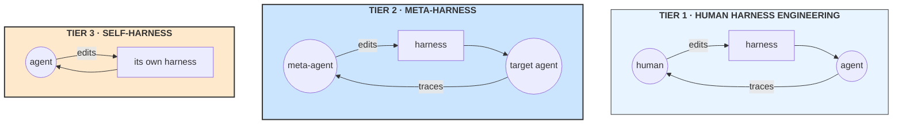

# **Module 9, Lesson 6: Autonomous Meta-Harness Systems**

### Building on What We've Learned

Module 8 established `Agent = Model + Harness`, and that most production failures are harness failures. The implied workflow was: a human reads traces, spots a pattern, edits the harness, re-runs the evals.

That loop works. It is also slow, and it is bounded by how many traces a human will read. The obvious question — *can the system do that itself?* — stopped being speculative in 2026. Systems that optimize their own harness now top public agent benchmarks, beating hand-engineered entries.

This lesson covers how they work and what they achieve. The next covers why most claims about them are overstated, and what to do about that.

### Learning Objectives

By the end of this lesson, you will be able to:
*   **Place** a system on the three-tier taxonomy: human harness engineering, meta-harness, self-harness.
*   **Describe** the propose-evaluate-accept loop and each of its three stages.
*   **Define** editable surfaces and explain why the frozen set matters more than the editable one.
*   **Design** an acceptance gate that resists the failure mode of optimizing toward your own evaluator.

---

### **1. Three Tiers of Harness Improvement**



| Tier | Who edits | Trade-off |
| :--- | :--- | :--- |
| **Human harness engineering** | A person, reading traces | Highest judgment, lowest throughput. Everything through Module 8 |
| **Meta-harness** | A *separate* agent optimizing a *target* agent | Scales; the optimizer is outside the system it optimizes, so it can be held fixed and audited |
| **Self-harness** | The agent edits its own operating harness | Fewest moving parts; self-referential, hardest to reason about, riskiest |

**Tier 2 is the sweet spot in practice**, and the reason is a governance one rather than a technical one: when the optimizer is a distinct component, you can pin its version, log everything it proposes, and evaluate the target independently. In tier 3, the thing being improved and the thing doing the improving share a fate — a bad edit degrades the editor.

---

### **2. What Actually Gets Optimized**

There is a ladder here, in increasing order of power and risk:

```
   instructions          system prompt text                    ← safest, most explored
        ↓
   structured context    what goes in the window, in what order
        ↓
   workflows             the topology — which node runs next     ← Lesson 4's graph
        ↓
   harness code          tool implementations, control flow, middleware
        ↓
   the optimizer itself  the code that proposes improvements     ← self-referential
```

Most production value today sits in the middle three rungs. The top rung — an agent modifying the mechanism that generates its future improvements — exists in research systems and is where the safety questions become genuinely hard.

**A concrete list of editable surfaces** from published systems: system prompts, bootstrap instructions, execution guidance, verification instructions, failure-recovery logic, runtime control policies, tool *descriptions*, tool *implementations*, middleware, sub-agent configurations, memory structures, and workflow topology.

Notice what is typically **not** on that list: model weights, the tool permission scope, and the evaluation harness. That omission is the entire subject of section 5 and of Lesson 7.

---

### **3. The Propose-Evaluate-Accept Loop**

Every system in this space runs some version of three stages.

**Stage 1 — Weakness mining.**
Cluster execution failures into *verifiable failure signatures*. The published systems are emphatic that a signature must capture **the terminal failure, the causal agent behaviour, and the abstract mechanism** — not the surface error code.

This matters because surface clustering produces useless groups. Twenty runs that all ended in `TimeoutError` may share nothing: five thrashed on search, five hit a slow tool, ten were stuck in a retry loop. Grouped by error code they look like one problem with one fix. Grouped by mechanism they are three problems, and the fix for each is different.

**Stage 2 — Bounded proposal.**
Generate candidate edits, each **grounded in one identified failure mechanism** and **mapped to one declared editable surface**. The published systems enforce **minimality**: an edit changes only what is necessary for its targeted mechanism, preserving unrelated behaviour.

Minimality is not fastidiousness. A broad rewrite that improves the score is uninterpretable — you cannot tell which part helped, cannot review it, and cannot revert half of it. Bounded edits keep the system's history a sequence of legible decisions instead of a series of replacements.

**Stage 3 — Acceptance, gated on held-out data.**
This is the load-bearing stage, and where naive implementations fail.

> A candidate is accepted only if it **improves or maintains** performance on **both** a held-in split (which supplied the evidence) and a **held-out split** (which the proposer never sees) — with at least one showing a positive gain, and **neither** regressing.

The held-out gate is what separates real improvement from fitting your own evaluator. Without it, the loop reliably discovers edits that raise the score on exactly the cases it was shown and nowhere else. Rejected candidates are **logged, not discarded** — the proposer reads them next round, and "we tried this and it regressed" is high-value context.

**And the gate must respect Module 6's arithmetic.** A +0.5% delta on a 200-case held-out split is *one flipped case*. A gate that accepts single-case deltas, queried over hundreds of rounds, accumulates noise as "improvement" — the Lesson 5 pathology, enabled by a threshold. Set the minimum gain as a number of **net flipped cases** (three or more), not a percentage that sounds small enough to be safe. Two mitigating facts: because the same cases are scored before and after, this is a *paired* comparison — considerably more sensitive than the unpaired ±1.96·√(0.25/n) margin from Module 6, Lesson 1 — and batching candidates per round reduces how often the gate is queried at all. Neither rescues a one-case threshold.

**The richest signal is the full trace, not a summary.** Published systems deliberately give the proposer filesystem access to source code, scores, and execution traces of *all* prior candidates, letting it `grep` and `cat` across twenty-plus previous attempts rather than receiving a compressed report. This is Module 4's just-in-time retrieval applied to the optimizer: give it identifiers and let it pull what it needs.

---

### **4. Multi-Objective: Accuracy Is Not the Only Axis**

A subtle and important design choice: optimize on a **Pareto frontier of accuracy against context cost**, not on accuracy alone.

Single-objective optimization on accuracy reliably discovers harnesses that are marginally better and dramatically more expensive — more retries, more sub-agents, more retrieved context. The gains are real; the economics are ruinous. Keeping cost as an explicit second axis surfaces the trade instead of hiding it, and the frontier gives a human something to choose from rather than a single take-it-or-leave-it answer.

The published results bear this out: one system reported **a 7.7-point accuracy improvement on text classification while using 4× fewer tokens** than the hand-engineered baseline. Both axes moved, because both were being optimized.

**Budget the loop itself, too.** Every candidate evaluation is a full run over the held-in and held-out splits — at 500 cases and a few thousand tokens each, a single candidate costs real money, and a search that proposes ten candidates a round for fifty rounds is a six-figure token bill before it finds anything. The published systems are quiet about this. Practical mitigations: batch and rank proposals before evaluating, evaluate the most promising first and stop the round early on an accept, and screen on a fixed subset before confirming on the full split — accepting that the screen introduces its own mild selection pressure, which the full-split confirmation exists to check.

---

### **5. What the Results Actually Show**

Reported figures, with the caveat that Lesson 7 will complicate all of them:

| System | Result |
| :--- | :--- |
| **Meta-Harness** (2026) | +7.7 pts text classification at **4× fewer tokens**; +4.7 pts on 200 IMO problems across five models; ranked **#1 on TerminalBench-2 for Haiku-class agents**, #2 for Opus-class |
| **Self-Harness** (2026) | On Terminal-Bench-2.0 **held-out**: MiniMax M2.5 40.5% → 61.9%; Qwen3.5-35B 23.8% → 38.1%; GLM-5 42.9% → 57.1% |
| **Darwin Gödel Machine** (ICLR 2026) | 20–50% improvement on SWE-bench; 14.2–30.7% on Polyglot. Improvements **generalized across foundation models** |

Three findings are more interesting than the headline numbers:

**A. Discovered harnesses transfer across models.** The DGM result — improvements holding when the underlying model is swapped — suggests these systems find genuine agent-design improvements rather than model-specific tricks. That is the strongest evidence that something real is being learned.

**B. Harnesses become model-specific in a useful way.** Self-Harness produced *different* harnesses for different base models, each targeting that model's distinct weaknesses, rather than converging on generic instruction padding. A harness tuned to a model's actual failure modes is a genuinely different artifact from a longer prompt.

**C. Two capabilities that look like one are separate.** The ability to **generate** a good harness edit and the ability to **benefit** from one are distinct, and they scale differently:

> **Harness-updating capability is roughly flat across model sizes. Harness-benefit capability is non-monotonic — middle-tier models gain the most.**

Frontier models already do internally much of what a harness edit would enforce, so they have less headroom. Very weak models cannot execute the improved procedure. The middle benefits most. One reported result: **9B-parameter models acquired procedurally isomorphic skills to Opus-class models** through harness optimization.

The practical implication is counterintuitive and worth stating plainly: **meta-harness optimization is most valuable for the models you would otherwise consider too weak** — which is also where the cost savings live.

---

### **Key Takeaways**

*   Three tiers: **human harness engineering → meta-harness (separate optimizer) → self-harness (self-referential)**. Tier 2 is the practical sweet spot, for governance reasons.
*   The optimization ladder runs **instructions → structured context → workflows → harness code → the optimizer itself**, in increasing power and risk.
*   The loop is **weakness mining → bounded proposal → acceptance**. Cluster failures by **mechanism**, not error code. Keep edits **minimal** so history stays legible.
*   **The held-out gate is load-bearing.** Accept only if held-in and held-out both hold, with no regression. Log rejected candidates — they're context.
*   **Optimize a Pareto frontier of accuracy against cost.** Single-objective optimization finds expensive wins.
*   Discovered harnesses **transfer across models**, become **usefully model-specific**, and benefit **middle-tier models most** — updating and benefiting are separate capabilities.

### **Hands-On Task: Design the Optimizer**

**Scenario.** You run a document-extraction agent — invoices, contracts, statements — at about 4,000 documents a day, on a mid-tier model. Accuracy is 84%; you want 90%+. You have six months of traces and a 600-case labeled eval set.

**Part A — Choose the tier.** Human, meta-harness, or self-harness? Justify it against your constraints, and name the specific risk your choice accepts.

**Part B — Declare the surfaces.** Write two lists:

1.  **Editable** — what the optimizer may change.
2.  **Frozen** — what it must not, whatever it proposes.

For each item in the frozen list, say what goes wrong if it were editable. *(At least three things belong in "frozen" that a naive design would leave open.)*

**Part C — Mine a weakness.** These 40 failures all surfaced as `SchemaValidationError: field 'total' expected number, got null`:

*   14 — invoice total in a footer image, not text
*   11 — multi-page invoices; total on page 2, agent read page 1 only
*   9 — total expressed as "Balance Due" rather than "Total"
*   6 — genuinely no total on the document

1.  Cluster these by **mechanism**, not error code. How many distinct problems?
2.  Write a verifiable failure signature for each cluster.
3.  For each, name the editable surface a fix would touch. Which cluster **should not be fixed by a harness edit at all**, and what should happen instead?

**Part D — Design the gate.** Your eval set has 600 cases.

1.  How do you split it? Say exactly what the proposer sees and what it never sees.
2.  Write the acceptance criterion as a boolean expression over held-in and held-out deltas.
3.  A candidate improves held-in by 9 points and held-out by 0.2 points. Accept or reject? Justify it, then say what that result *tells you* about the candidate.
4.  Your loop plateaus after twelve rounds. Give **two** distinct explanations — one benign, one that means the setup is broken — and the measurement that distinguishes them.
